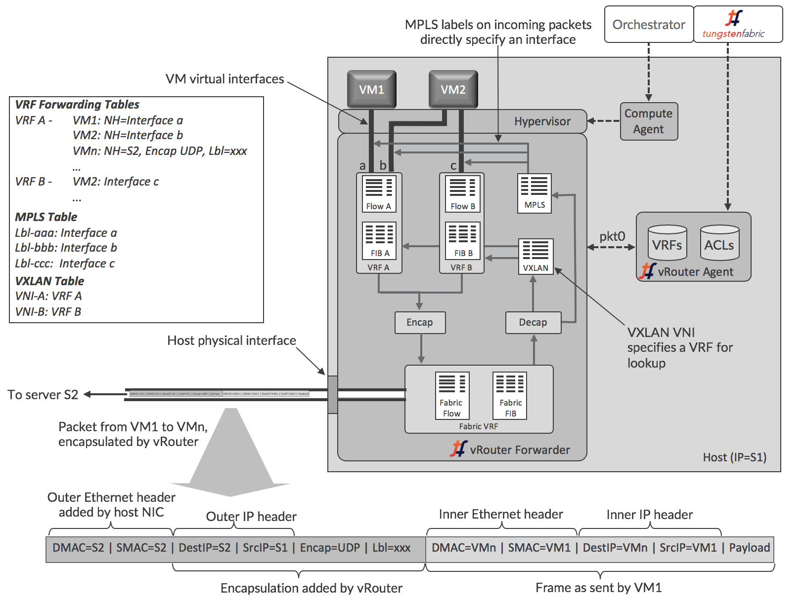
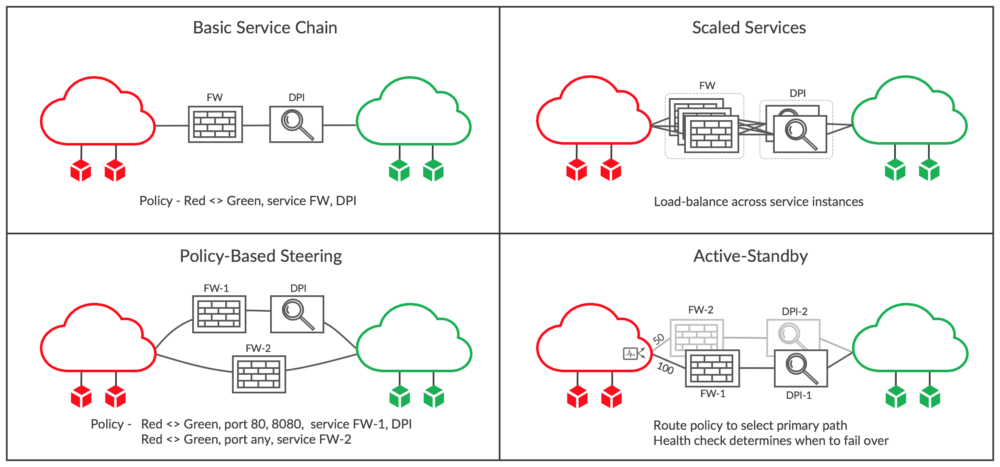
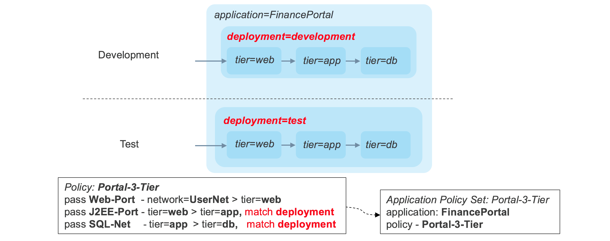
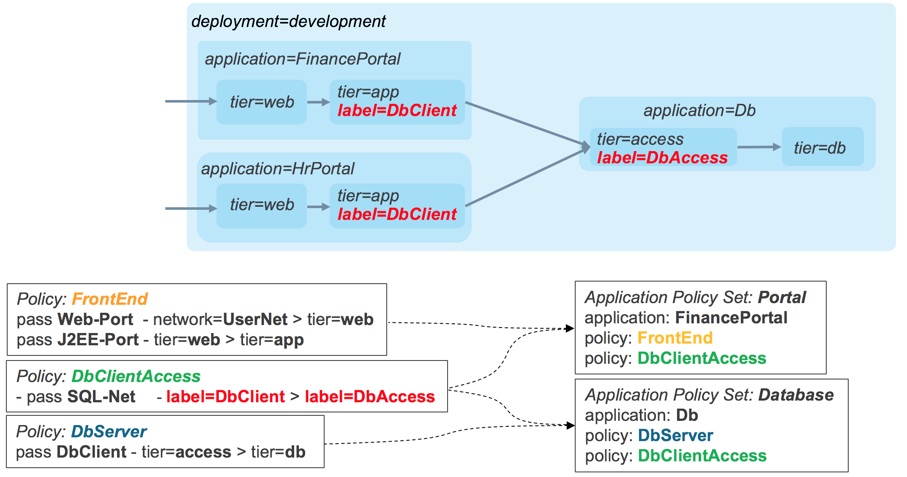
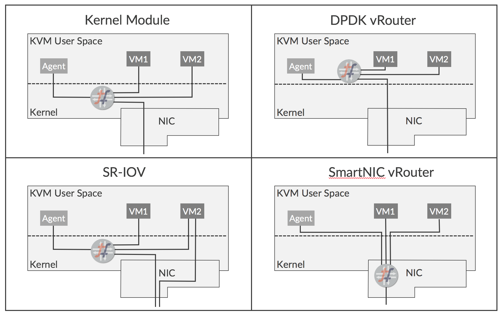
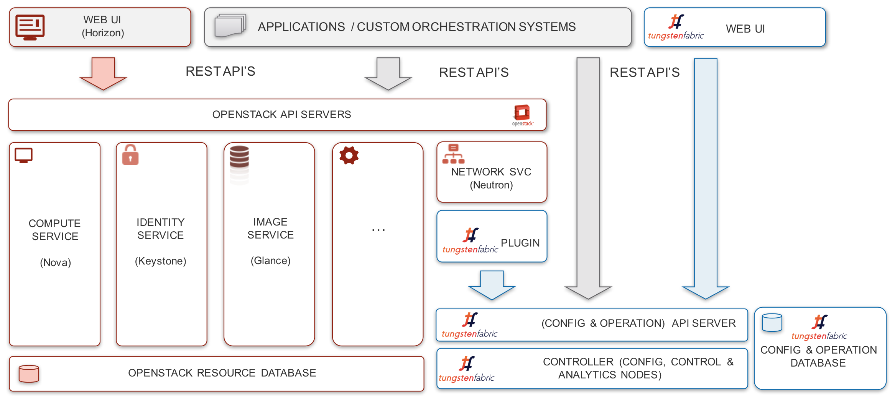
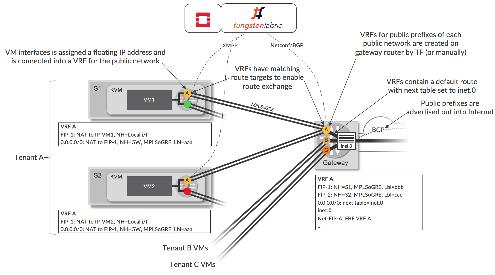

## Tungsten Fabric 架构

### 虚拟网络和安全平台的详细技术描述


**[介绍](#introduction)**  
&nbsp;&nbsp;&nbsp;&nbsp;
_[用例](#use-cases)_  
&nbsp;&nbsp;&nbsp;&nbsp;
_[Tungsten Fabric主要特点 ](#key-features)_  

**[Tungsten Fabric怎么运作](#how-tf-works)**  
&nbsp;&nbsp;&nbsp;&nbsp;
_[Tungsten Fabric支持Orchestrator](#tf-with-orchestrator)_  
&nbsp;&nbsp;&nbsp;&nbsp;
_[和Orchestrator的互动](#working-with-orchestrator)_  

**[vRouter架构解说](#vrouter-details)**  
&nbsp;&nbsp;&nbsp;&nbsp;
  _[详细的vRouter封包处理逻辑](#packet-processing)_  
&nbsp;&nbsp;&nbsp;&nbsp;
  _[相同子网虚拟机之间封包流](#packet-flow-same-subnet)_  
&nbsp;&nbsp;&nbsp;&nbsp;
  _[不同子网虚拟机之间封包流](#packet-flow-different-subnet)_  

**[服务链](#service-chains)**   
&nbsp;&nbsp;&nbsp;&nbsp;
  _[基本服务链](#basic-service-chain)_  
&nbsp;&nbsp;&nbsp;&nbsp;
  _[扩展性服务](#scaled-out-service)_  
&nbsp;&nbsp;&nbsp;&nbsp;
  _[基于策略的流转向](#policy-based-steering)_  

**[基于应用程序的安全策略](#application-policies)**  
&nbsp;&nbsp;&nbsp;&nbsp;
  _[创建应用程序策略](#creating-policy)_  
&nbsp;&nbsp;&nbsp;&nbsp;
  _[控制部署之间的流](#flows-between-deployment)_  
&nbsp;&nbsp;&nbsp;&nbsp;
  _[高级应用策略](#advanced-policies)_  

**[vRouterd的部署选项](#vrouter-deployment-options)**  
&nbsp;&nbsp;&nbsp;&nbsp;
  _[内核模块的vRouter](#kernel-module-vrouter)_  
&nbsp;&nbsp;&nbsp;&nbsp;
  _[DPDK vRouter](#dpdk-vrouter)_  
&nbsp;&nbsp;&nbsp;&nbsp;
  _[SR-IOV (單一根I/O 虛擬化)](#sriov-vrouter)_  
&nbsp;&nbsp;&nbsp;&nbsp;
  _[智能网卡的vRouter](#smartnic-vrouter)_  

**[Tungsten Fabric的收集和分析](#tf-analytics)**  

**[Tungsten Fabric的部署](#tf-deployment)**  

**[Tungsten Fabric APIs](#tf-apis)**  
&nbsp;&nbsp;&nbsp;&nbsp;
  _[控制器配置 REST API](#tf-rest-apis)_  
&nbsp;&nbsp;&nbsp;&nbsp;
  _[Python语言的绑定](#tf-python)_  
&nbsp;&nbsp;&nbsp;&nbsp;
  _[分析的REST API](#tf-analytics-rest-api)_  

**[Orchestrators](#tf-orchestrators)**  
&nbsp;&nbsp;&nbsp;&nbsp;
  _[OpenStack使用Tungsten Fabric](#tf-openstack)_  
&nbsp;&nbsp;&nbsp;&nbsp;
  _[Kubernetes容器使用Tungsten Fabric](#tf-kubernetes)_  
&nbsp;&nbsp;&nbsp;&nbsp;
  _[Tungsten Fabric 和 VMware vCenter](#tf-vcenter)_  
&nbsp;&nbsp;&nbsp;&nbsp;
  _[嵌套 Kubernetes with OpenStack or vCenter](#tf-nested-kubernetes)_  

**[连接到物理网络](#tf-physical)**  
&nbsp;&nbsp;&nbsp;&nbsp;
  _[启用BGP的网关](#tf-bgp-gateway)_  
&nbsp;&nbsp;&nbsp;&nbsp;
  _[源NAT](#tf-source-nat)_  
&nbsp;&nbsp;&nbsp;&nbsp;
  _[在底层网络(Underlay)中的路由](#tf-underlay-routing)_


## 介绍 {#introduction}

本文档介绍了Tungsten Fabric如何提供可扩展的虚拟网络平台，该平台可与各种虚拟机和容器协调器配合使用，并可与物理网络和计算基础架构集成。 Tungsten Fabric使用网络行业标准（如BGP EVPN控制平面和VXLAN覆盖）来无缝连接不同协调器域中的工作负载。 例如。 由VMware vCenter管理的虚拟机和由Kubernetes管理的容器。

随着虚拟化成为提供公共云和私有云服务的关键技术，迄今为止广泛使用的虚拟化技术（例如，使用L2网络的VMware，以及OpenStack的Nova，Neutron或ML2网络），网络规模问题日益明显。 Tungsten Fabric提供高度可扩展的虚拟网络平台，旨在支持最大环境中的多租户网络，同时支持多个协调器。

由于很少有数据中心部署是真正的“绿场”，因此几乎总是要求将部署在新基础架构上的工作负载与之前部署的工作负载和网络相集成。 本文档描述了一组部署方案，其中将部署新的云基础架构，并且还需要与现有基础架构共存。

### 用例 {#use-cases}

本文档包含以下常见用例:

*   在OpenStack管理的数据中心中实现具有高可扩展性和灵活性的平台即服务和软件即服务
*   使用Kubernetes容器管理系统的虚拟网络，包括Red Hat OpenShift
*   允许运行VMware vCenter的新的或现有的虚拟化环境在虚拟机之间使用Tungsten Fabric虚拟网络
*   直接通过数据中心底层网络使用BGP peering和网络覆盖与网关路由器将Tungsten Fabric虚拟网络连接到物理网络。

这些用例可以任意组合部署，以满足各种部署方案中的特定要求。 Tungsten Fabric的主要特征如下所示。


支持主要用例的关键功能是:

*   虚拟网络使用虚拟主机之间的封装隧道
*   用于虚拟机和容器的开源协调器的插件
*   基于标签的基于应用程序的安全策略
*   与VMware业务流程堆栈集成
*   使用BGP，SNAT和底层网络连接到外部网络.

由于在每个实现中都使用相同的控制器和转发组件，因此Tungsten Fabric提供了一致的界面来管理其支持的所有环境中的连接，并且能够在不同的协调器（无论是虚拟机还是容器）管理的工作负载之间提供无缝连接，以及 到外部网络的目的地。


### Tungsten Fabric主要特点 {#key-features}

Tungsten Fabric使用OpenStack和Kubernetes协调器在云环境中管理和实施虚拟网络。 Tungsten Fabric在每台主机上运行的vRouters之间使用覆盖网络。它基于成熟的和标准的网络技术，如今支持世界主要服务提供商的广域网，但重新用于数据中心的虚拟化工作负载和云自动化，范围从大型企业数据中心到 较小的电信公司POPs。 它在协调器的本机网络实现上提供了许多增强功能，包括：


*   高度可扩展的多租户网络
*   多租户IP地址管理
*  DHCP，ARP代理，以避免泛滥到网络
*   广播和多播流量的高效边缘复制
*   本地，每个租户的DNS解析
*   带访问控制列表的分布式防火墙
*   基于应用程序的安全策略
*  跨主机的分布式负载平衡
*   网络地址转换（1：1浮动IP和分布式SNAT）
*   使用服务链接进行虚拟网络功能
*   IPv4和IPv6双栈支持
*   BGP与网关路由器对等
*   BGP即服务（BGPaaS），用于在私有管理的客户网络和服务提供商网络之间分配路由

以下部分详细描述了控制器如何与协调器和vRouters交互，以及如何在vRouter中实现和配置上述功能。


## Tungsten Fabric怎么运作 {#how-tf-works}

本节介绍Tungsten Fabric控制器和vRouter的软件体系结构，它在每个主机中转发封包，并描述虚拟机或容器启动时vRouters与Tungsten Fabric控制器之间的交互，然后相互交换封包。


### Tungsten Fabric支持Orchestrator {#tf-with-orchestrator}

Tungsten Fabric控制器集成了OpenStack或Kubernetes等云管理系统。 其功能是确保在创建虚拟机（VM）或容器时，根据控制器或协调器中指定的网络和安全策略为其提供网络连接。

Tungsten Fabric由两个主要软件组成
*   _Tungsten Fabric 控制器_– 一组维护网络和网络策略模型的软件服务，通常在多个服务器上运行以实现高可用性
*   _Tungsten Fabric vRouter_– 安装在运行工作负载（虚拟机或容器）的每个主机上，vRouter执行封包转发并实施网络和安全策略。

Tungsten Fabric的典型部署如下所示.


Tungsten Fabric控制器通过软件插件与协调器集成，该插件实现了协调器的网络服务。 例如，OpenStack的Tungsten Fabric插件实现了Neutron API，_kube-network-manager_和_CNI_（容器网络接口）组件使用Kubernetes k8s API监听网络相关事件。

Tungsten Fabric vRouter取代Linux桥接器和IP表，或计算主机上的Open vSwitch网络，控制器配置vRouters以实现所需的网络和安全策略。

VM的封包如果要转发到不同主机上，vRouter会加MPLS over UDP / GRE或VXLAN封装，其中外部标头的目标是运行目标VM的主机的IP地址。控制器负责在每个实现网络策略的vRouter的每个VRF中安装路由集。例如：默认情况下，同一网络中的虚拟机可以相互通信，但不能与不同网络中的虚拟机进行通信，除非在网络策略中特别允许。控制器和vRouters之间的通信是通过一种广泛使用且灵活的消息传递协议XMPP实现的。

云自动化的一个关键特性是用户可以为其应用程序请求资源，而无需了解如何或甚至在何处提供资源的详细信息。这通常是通过一个门户网站完成的，该门户网站提供了一组服务产品，用户可以从中选择，并将其转换为API调用到底层系统，包括云协调器，以启动具有必要内存，磁盘和CPU的虚拟机或容器满足用户要求的能力。服务产品可以像具有特定内存，分配给它的磁盘和CPU的VM一样简单，也可以包括由多个预配置软件实例组成的整个应用程序堆栈。


### 和Orchestrator的互动 {#working-with-orchestrator}

Tungsten Fabric控制器和vRouter的架构以及与协调器的交互如下所示。


该图显示了一个协调器工作虚拟机管理程序和虚拟机，这和容器协调器的信息流类似，例如Kubernetes（参见XXX [带有Tungsten Fabric的Kubernetes容器]。主机上运行的工作负载的每个接口都连接到VRF包含相应网络的L2和L3转发表，其中包含该接口的IP地址。vRouter实现物理路由器执行的集成桥接和路由（IRB）功能。vRouter仅具有位于该主机上有网络接口的VRF，包括连接到主机物理接口的Fabric VRF。使用VRF可以使不同的虚拟网络具有重叠的IP和MAC地址，不会定义任何网络策略来允许它们之间的流量。Tungsten Fabric虚拟化网络使用封装隧道在不同主机上的VM之间传输封包，以及封装和解封装在Fabric VRF和VM VRF之间发生。这将在下一节中详细解释。

创建新的虚拟工作负载时，会在特定于orchestrator的插件中看到一个事件并将其发送到控制器，然后控制器会向代理发送请求以便在虚拟网络的VRF中安装路由，然后代理将其配置在转发器里。

使用单个接口在新VM上配置网络的逻辑流程如下：


1.  使用UI，CLI或北向REST API在Orchestrator或Tungsten Fabric中定义网络和网络策略。 网络主要定义为IP地址池，在创建VM时将分配给接口。
2.   用户请求由协调器启动VM，包括其接口所在的网络。
3.  协调器选择要运行的新VM的主机，并指示该主机上的计算代理程序获取其映像并启动VM。
4.  Tungsten Fabric插件从协调器的网络服务接收事件或API调用，指示它为将要启动的新VM的接口设置网络。 这些指令将转换为Tungsten Fabric REST调用并发送到Tungsten Fabric控制器。
5.  Tungsten Fabric控制器向vRouter代理发送请求，以便将新VM虚拟接口连接到指定的虚拟网络。 vRouter代理指示vRouter转发器将VM接口连接到虚拟网络的VRF。 如果不存在，则创建VRF，并且接口连接到它。
6.  计算代理启动VM，通常将其配置为使用DHCP为其每个接口请求IP地址。 vRouter代理DHCP请求，然后对接口IP地址，默认网关和DNS服务器地址进行响应。
7.  一旦接口启动且具有来自DHCP的IP地址，vRouter安装到VM的IP和MAC地址路由，并将下一跳设为VM虚拟接口。
8.  vRouter为接口分配标签，并在MPLS表中安装标签路由。 vRouter向控制器发送XMPP消息，该消息包含到新VM的路由。该路由具有运行vRouter的服务器的IP地址的下一跳，并使用刚刚分配的标签指定封装协议。
9.  在网络策略所允许下，控制器将新VM路由分发到其他vRouters，包含VM位于同一网络和其他网络。
10.  在网络策略所允许下，控制器将其他VM的路由发送到新VM的vRouter。

在此过程结束时，已更新数据中心中所有vRouter的VRF中的路由已经有新VM的信息。


## vRouter架构解说 {#vrouter-details}

本节更详细地介绍了Tungsten Fabric vRouter的体系结构。 Tungsten Fabric vRouter的功能组件的概念视图如下所示。



vRouter代理在主机操作系统的用户空间中运行，而转发器可以是内核模块，DPDK时在用户空间，或者在可编程网络接口卡（也称为“智能网卡”）中运行。这些选项在[vRouter的部署选项]部分中有更详细的描述。这里说明了更常用的内核模块模式。

代理与控制器保持会话，并发送有关其所需的VRF，路由和访问控制列表（ACL）的信息。代理将信息存储在自己的数据库中，并使用该信息配置转发器。接口连接到VRF，每个VRF中的转发信息库（FIB）配置转发条目。

每个VRF都有自己的转发表和流表，然而MPLS和VXLAN表在vRouter中是全局的。转发表包含目的地的IP和MAC地址的路由，并且IP到MAC关联用于提供代理ARP功能。当VM接口启动时，vRouter选择MPLS表中的标签值，并且仅对该vRouter本地有意义。VXLAN网络标识符在Tungsten Fabric域内不同vRouters中的同一虚拟网络的所有VRF中是全局的。

每个虚拟网络都有一个分配给它的默认网关地址，每个虚拟机或容器接口在初始化时获得的DHCP响应中接收该地址。当工作负载将封包发送到其子网外的地址时，它将为与网关IP的IP地址对应的MAC进行ARP，并且vRouter以其自己的MAC地址进行响应。因此，vRouters支持所有虚拟网络的完全分布式默认网关功能。

### 详细的vRouter封包处理逻辑 {#packet-processing}

从VM流入VM并进入VM的封包的逻辑细节略有不同，并在以下两个图和描述中进行了描述。


当从VM通过虚拟接口发送封包时，转发器接收该封包后首先检查接口所在的VRF流表中是否存在与封包的5元组匹配的条目（协议，源和目标IP地址，源和目标TCP或UDP端口）。如果这是流中的第一个封包，则不会有条目，转发器通过pkt0接口将封包发送给代理。代理根据VRF路由表和访问控制列表确定流的操作，并使用结果更新流表。动作可以是DROP，FORWARD，NAT或MIRROR。如果要转发封包，转发器将检查目标MAC地址是否是其自己的MAC地址，如果VM在目标位于VM的子网外时将封包发送到默认网关。在这种情况下，在IP转发表中查找目的地的下一跳，否则MAC地址用于查找。 vRouter在该计算节点内此处执行物理路由器的IRB（集成路由和桥接）功能。


当封包从物理网络到达时，vRouter首先检查封包是否具有支持的封装。如果不是，则将封包发送到主机操作系统。对于基于UDP的MPLS和基于GRE的MPLS，标签直接标识VM接口，但VXLAN需要由VLAN网络标识符（VNI）标识的VRF中查找内部报头中的目标MAC地址。 一旦识别出接口，如果没有为接口设置策略标志（指示允许所有协议和所有TCP / UDP端口），则vRouter可以立即转发封包。否则，使用5元组来查找流表中的流，并使用与针对传出分组所描述的逻辑相同的逻辑。


### 相同子网虚拟机之间封包流 {#packet-flow-same-subnet}

VM中的应用程序首先将封包发送到另一个VM时发生的操作顺序如下图所示。 起点是两个VM都已启动，并且控制器已将L2（MAC）和L3（IP）路由发送到两个vRouters以启用VM之间的通信。发送VM先前没有将数据发送到另一个VM，因此之前没有通过DNS解析目标名称。


1.  VM1需要向VM2发送封包，因此首先查找自己的DNS缓存以获取IP地址，但由于这是第一个封包，因此没有条目。
2.  VM1在其接口出现时向DHCP响应中提供的DNS服务器地址发送DNS请求。
3.  vRouter捕获DNS请求并将其转发到在Tungsten Fabric控制器中运行的DNS服务器。
4.  控制器中的DNS服务器以VM2的IP地址响应。
5.  vRouter将DNS响应发送给VM1。
6.  VM1需要形成以太网帧，因此需要VM2的MAC地址。 它会检查自己的ARP缓存，但没有条目，因为这是第一个封包。
7.  VM1发出ARP请求。
8.  vRouter捕获ARP请求并在其自己的转发表中查找IP-VM2的MAC地址，并在控制器为VM2发送的L2 / L3路由中找到关联。
9.  vRouter向VM1发送ARP回复，其MAC地址为VM2。
10.  VM1的网络堆栈中发生TCP超时。
11.  VM1的网络堆栈重试发送封包，这次在ARP缓存中找到VM2的MAC地址，并可以形成以太网帧并将其发送出去。
12.  vRouter查找VM2的MAC地址并找到封装路由。 vRouter构建外部头部并将结果封包发送到S2。
13.  S2上的vRouter解封装封包并查找MPLS标签以识别要将原始以太网帧发送到的虚拟接口。 以太网帧被发送到接口并由VM2接收。


### 不同子网虚拟机之间封包流 {#packet-flow-different-subnet}

将封包发送到不同子网中的目标时的顺序是相同的，只是vRouter作为默认网关响应。VM1将在以太网帧中发送封包，其中包含默认网关的MAC地址，其IP地址是在VM1启动时vRouter提供的DHCP响应中提供的。当VM1对网关IP地址发出ARP请求时，vRouter将使用自己的MAC地址进行响应。当VM1使用该网关MAC地址发送以太网帧时，vRouter使用帧内封包的目的IP地址在VRF中查找转发表以查找路由，该路由将通过封装隧道连接到主机 目的地正在运行。


## 服务链 {#service-chains}

当网络策略指定两个网络之间的流量必须流经一个或多个网络服务（例如防火墙，TCP代理，负载平衡器......）时，即形成服务链，这些网络服务也称为虚拟网络功能（VNF）。 网络服务在虚拟机中实现，这些虚拟机在Tungsten Fabric中标识为服务，然后包含在策略中。 Tungsten Fabric支持OpenStack和VMware vCenter环境中的服务链。 下面显示了在两个VM之间实现服务链的路由的简化视图（在实际的Tungsten Fabric实现中，特殊的“服务”VRF包含在服务链的路由中）。


当在控制器中将VM配置为服务实例（VNF），并在网络策略中应用该服务实例时，控制器将在“Left”和“Right”端口所在的VRF中安装路由，用于引导流量通过VNF。当封装路由通过VNF vRouter发布回控制器时，路由将分发给具有Red和Green VRF的其他vRouters，最终结果是一组路由指示Red和Green网络之间的流量通过该服务实例。 当VNF启动时，通过标签“Left”和“Right”标识顺序激活的接口。 VNF必须有一个配置，该配置将根据数据包将到达的接口正确地处理这些数据包。

服务（VNF）有三种类型:


*   _Layer 2 Transparent_ -以太网帧被发送到服务中，其目标MAC地址是原始目的地的MAC地址。 这最常用于深度包检测服务。
*   _Layer 3 (In Network)_ - 以太网帧被发送到服务中，其目的地MAC设置为服务的入口接口的MAC，终止L2连接并使用出口MAC作为发送到目的地的帧的源MAC建立新的连接。 这用于防火墙，负载平衡器和TCP代理。
*   _Layer 3 (NAT)_ - 类似 _In Network_, 除了服务将源IP地址更改为可从目的地路由的地址（网络地址转换）。

下面说明各种服务链场景，并且随后进行简要说明。





### 基本服务链 {#basic-service-chain}

在第一个面板中，通过编辑Red和Green网络之间的网络策略来创建简单的服务链，包括服务FW和DPI。这些是先前在OpenStack或vCenter中启动的虚拟机，然后在Tungsten Fabric中配置为具有Red和Green网络中的接口的服务实例。保存策略并将其应用于两个网络后，将修改所有附加了Red或Green VM的vRouters中的路由，以通过服务链发送流量。例如，在修改策略之前，Red网络中的每个VRF都有一条到绿色网络中每个VM的路由，其中​​包含运行VM的主机的下一跳以及控制器指定了主机vRouter的标签。路由被修改为具有FW服务实例的入口VRF的下一跳，以及为FW Left接口指定的标签。Right FW接口所在的VRF具有指向DPI左侧接口的所有Green目的地的路由，并且DPI的right VRF将包含所有绿色目的地的路由以及它们运行的​​主机的下一跳和原始路由标签。类似地处理反向流量的路由。


### 规模化的服务 {#scaled-out-service}

当单个VM没有处理服务链流量要求的能力时，可以在服务中包含多个相同类型的VM，如第二个面板所示。 完成此操作后，使用ECMP在两端服务链的入口接口对流量进行负载均衡，并在不同服务实例之间进行负载均衡。

可以根据需要在Tungsten Fabric中添加新的服务实例，虽然传统的ECMP哈希算法实现通常会在目标数量发生变化时将大多数会话移动到其他路径，但在Tungsten Fabric中，这仅适用于新流，因为现有路径流量是根据vRouter中的详细处理逻辑章节中描述的流表确定的。 此行为对于必须查看流中的所有数据包的有状态服务至关重要，否则流将被阻止，从而导致用户会话中断。

还填充了反向流表，以确保流中反向的流量通过它来自的相同服务实例。

互联网草案 https://datatracker.ietf.org/doc/draft-ietf-bess-service-chaining 上包含有关具有状态服务的扩展服务链的更多详细信息。

### 基于策略指导 {#policy-based-steering}

有些情况下，不同类型的流量需要传递到不同的服务链中。 这可以通过在网络或安全策略中包含多条子策略来在Tungsten Fabric中实现。在图中的示例中，端口80和8080上的流量必须通过防火墙（FW-1）和DPI，而所有其他流量仅通过防火墙（FW-2），其可能具有与防火墙FW-1不同的配置。

### 主-备服务链{#active-standby}

在某些情况下，流量通常需要通过某个特定的服务链，但如果检测到该链存在问题，则应将流量切换为备份。 这可能是备用服务链位于不太有利的地理位置的情况。

在Tungsten Fabric中，主-备机制配置分两步完成。 首先，将路由策略应用于每个服务链的入口，为优选的活动链入口指定较高的本地优先级值。 其次，每个链上都附有一个运行状况检查，可以测试服务实例是否可达，或者是否可以到达链的另一侧的目的地。如果运行状况检查失败，则撤消到正常活动服务链的路由，并且流量将流经备用服务链。


## 基于应用的安全策略 {#application-policies}

常规防火墙策略包含基于单个IP地址或子网范围的规则。 在任何规模的数据中心中，这会导致防火墙规则的激增，这些规则在创建时难以管理，在故障排除时难以理解。 这是因为服务器或VM的IP地址与应用程序，应用程序所有者，位置或任何其他属性无关。例如，考虑一个拥有两个数据中心并在开发和生产中部署三层应用程序的企业，如下所示。


在该企业中，要求每层应用程序的每个实例只能与下一层的实例通信。 这需要为每个应用程序实例单独的策略，如图所示。 在解决问题时，管理员必须知道IP地址和应用程序实例之间的关系，并且每次部署新实例时，都必须编写新的防火墙规则。


### 应用标签 {#tags}

Tungsten Fabric控制器支持基于标签的安全策略，可应用于项目，网络，vRouters，VM和接口。 标签在对象模型中传播到应用标签的对象中包含的所有对象，并且在包含层次结构的较低级别应用的标签优先于在较高级别应用的标签。 标签有名称和值。许多标签名称作为Tungsten Fabric发布版本的一部分。 标签类型的典型用途如下表所示：


<table>
  <tr>
   <td><strong>标签名称</strong>
   </td>
   <td><strong>典型应用</strong>
   </td>
   <td><strong>例子</strong>
   </td>
  </tr>
  <tr>
   <td>应用
   </td>
   <td>标识一组运行不同类型组合的软件实例的VM，以支持最终用户或其他服务访问的服务。 可以对应一个Heat堆栈。
   </td>
   <td>LAMP堆栈，Hadoop集群，一组NTP服务器，Openstack / Tungsten Fabric集群
   </td>
  </tr>
  <tr>
   <td>层
   </td>
   <td>应用程序堆栈中执行相同功能的一组相同类型的软件实例。 可以根据不同堆栈中的性能要求来缩放这种实例的数量。
   </td>
   <td>Apache Web服务器，Oracle数据库服务器，Hadoop从属节点，OpenStack服务容器
   </td>
  </tr>
  <tr>
   <td>部署
   </td>
   <td>表示一组VM的用途。 通常适用于堆栈中的所有VM
   </td>
   <td>开发，测试，生产
   </td>
  </tr>
  <tr>
   <td>站点
   </td>
   <td>表示堆栈的位置，通常是数据中心的粒度。
   </td>
   <td>美国东部，伦敦，内华达州-2
   </td>
  </tr>
  <tr>
   <td>定制化
   </td>
   <td>根据需求创建的新标签
   </td>
   <td>实例名称
   </td>
  </tr>
  <tr>
   <td>标签
   </td>
   <td>可以应用多个标签来提供对堆栈内和堆栈之间的数据流的细粒度控制
   </td>
   <td>客户访问，财务门户，数据库客户端访问
   </td>
  </tr>
</table>


如表中所示，除了Tungsten Fabric提供的标记类型之外，用户还可以根据需要创建自己的自定义标记名称，并且有一个_label _type标记可用于更精细地调整数据流。


### 创建应用程序策略 {#creating-policy}

应用程序策略包含基于标记值和服务组的规则，这些规则值和服务组是TCP或UDP端口号的集合。 首先，安全管理员为应用程序堆栈分配类型为_application _的标记，并为应用程序的每个软件组件分配类型为_tier _的标记。 这如下图所示。


在此示例中，已为流量进入应用程序堆栈和每个层之间创建应用程序标记为_FinancePortal _并且层标记为_web，app _和_db._Service组。 然后，安全性管理员创建一个名为_Portal-3-Tier _containing规则的应用程序策略，该规则将仅允许所需的流量。然后，应用程序策略集与应用程序标记FinancePortal关联，并包含应用程序策略_Portal-3-Tier。 _此时，可以启动应用程序堆栈，并将标签应用于Tungsten Fabric控制器中的各个VM。这会导致控制器计算需要将哪些路由发送到每个vRouter以强制执行应用程序策略集，并将这些路由发送到每个vRouter。 如果每个软件组件都有一个实例，则每个vRouter中的路由表如下：


<table>
  <tr>
   <td><strong>Host</strong>
   </td>
   <td><strong>VRF</strong>
   </td>
   <td><strong>Source</strong>
   </td>
   <td><strong>Destination</strong>
   </td>
   <td><strong>Ports</strong>
   </td>
   <td><strong>Route</strong>
   </td>
  </tr>
  <tr>
   <td>S1
   </td>
   <td>Net-web
   </td>
   <td>0.0.0.0/0 \
10.1.1.3/32 \
10.1.1.3/32
   </td>
   <td>10.1.1.3/32 \
10.1.2.3/32 \
0.0.0.0/0
   </td>
   <td>80 \
8080 \
Any
   </td>
   <td>Interface for VM-web \
NH=S2, Lbl=10 \
Route to Internet
   </td>
  </tr>
  <tr>
   <td>S2
   </td>
   <td>Net-app
   </td>
   <td>10.1.1.3/32110.1.2.3/321010.1.2.3/32
   </td>
   <td>10.1.2.3/32 \
10.1.3.3/32 \
10.1.1.3/32
   </td>
   <td>8080 \
1521, 1630 \
1521, 1630
   </td>
   <td>Interface for VM-app \
NH=S3, Lbl=12 \
NH=S1, Lbl=5
   </td>
  </tr>
  <tr>
   <td>S2
   </td>
   <td>Net-db
   </td>
   <td>10.1.2.3/3210.1.3.3/32
   </td>
   <td>10.1.3.3/32 \
10.1.2.3/32
   </td>
   <td>1521, 1630 \
1521, 1630
   </td>
   <td>Interface for VM-db \
NH=S3, Lbl=12
   </td>
  </tr>
</table>


网络和虚拟机在这里被命名为它们所在的层。实际上，实体名称和层之间的关系通常不会那么简单。 从表中可以看出，路由仅启用应用策略中指定的流量，但此处基于标签的规则已转换为vRouter能够应用的基于网络地址的防火墙规则。


### 控制部署之间的流量 {#flows-between-deployment}

成功创建应用程序堆栈之后，让我们看一下创建堆栈的另一个部署时会发生什么，如下所示。


原始策略中没有任何内容阻止流量在一个部署中的层之间流动到另一个部署中的层。 可以通过使用_deployment _tag标记每个堆栈的每个组件，并在应用程序策略中添加_match _condition来允许流量仅在部署标记匹配时在层之间流动来修改此行为。 更新后的政策如下所示。




现在，流量符合严格的要求，即流量仅在同一堆栈内的组件之间流动。


### Advanced Application Policies {#advanced-policies}

应用不同类型的标签允许安全策略在多个维度中应用，所有这些都在单个策略中。 例如，在下图中，单个策略可以根据站点对单个堆栈内的流量进行分段，但允许在站点内共享数据库层。





如果在相同的站点和部署组合中部署了多个堆栈，则可以创建实例名称的自定义标记，并且可以使用实例标记上的匹配条件来创建所需的限制，如下图所示。


Tungsten Fabric中的应用程序策略功能提供了一个非常强大的实施框架，同时可以显着简化策略并减少其数量。


## vRouter的部署选项 {#vrouter-deployment-options}

vRouter有多种部署选项，可提供不同的好处和易用性：


*   **Kernel Module**– 这是默认部署模式
*   **DPDK**– 使用英特尔库提供转发加速
*   **SR-IOV**– 提供从VM直接访问NIC
*   **Smart NIC**– vRouter转发器在可编程NIC中实现

这些选项如下所示:



每个选项的功能和优点如下所述:

### 内核模块vRouter {#kernel-module-vrouter}

今天的默认部署选项是vRouter转发器在Linux内核中运行的模块的方式。 vRouter实现了网络功能，否则将使用iptables或Open vSwitch来执行。在内核中运行使转发器在通过KVM的网络堆栈时可以直接访问网络流量，并且与转发器作为用户空间中的进程运行时相比，可以实现显着的性能提升。 已实施的优化包括：

*   TCP分片卸载
*   大量接收卸载
*   使用多队列virtio数据包处理

内核模块方法允许用户使用Tungsten Fabric实现网络虚拟化，同时对底层服务器和NIC硬件的依赖性最小。 但是，仅支持特定的Linux内核版本。


### DPDK vRouter {#dpdk-vrouter}

英特尔的数据平面开发工具包（DPDK）是一组库和驱动程序，允许在用户空间中运行的应用程序无需通过KVM网络堆栈即可直接访问NIC。 可以在用户空间中运行并支持DPDK的vRouter转发器版本。 与具有未修改的VM的内核模块相比，DPDK vRouter提供了加速的数据包吞吐量，如果Guest VM也启用了DPDK，则可以实现更好的性能。

DPDK vRouter通过将CPU内核专用于数据包转发来工作，该数据包转发循环不断地等待数据包。 这些核心不仅不能用于运行Guest VM，因为它们连续100％运行，这在某些环境中可能是个问题。


### SR-IOV (Single Root – 输入/输出虚拟化) {#sriov-vrouter}

SR-IOV不是vRouter本身的严格部署选项，但在某些应用程序中可以与vRouter一起使用。 SR-IOV允许NIC的硬件资源在多个客户端之间共享，就好像每个客户端都具有唯一访问权限一样，就像管理程序对CPU一样。它使VM接口可以直接访问NIC，因此数据路径会绕过虚拟机管理程序网络堆栈，从而提高性能。当VM在物理网络和虚拟网络之间执行网关功能时，SR-IOV非常有用，但由于SR-IOV涉及绕过vRouter，因此接口不参与Tungsten Fabric虚拟网络而,并且不参与网络 策略和网络服务。


### 智能 NIC vRouter {#smartnic-vrouter}

一些新的可编程NIC正在变得可用。 Tungsten Fabric vRouter转发器功能可以在这些新的NIC上实现，这在性能方面带来了实质性的提升，特别是对于在某些环境中占主导地位的小字节数据包。 此外，转发几乎完全从服务器的x86 CPU卸载，因此可以释放CPU内核以用于更多VM。

智能NIC看起来非常有前途，但显然要求智能NIC在生产环境中可用，并且它们需要时间才能广泛使用。


## Tungsten Fabric 收集和分析 {#tf-analytics}

Tungsten Fabric从云基础架构（计算，网络和存储）及其上运行的工作负载收集信息，以便于运营监控，故障排除和容量规划。 数据以各种格式收集，例如系统日志，结构化消息（称为Sandesh），Ipfix，Sflow和SNMP。诸如vRouters，物理主机，虚拟机，接口，虚拟网络和策略之类的对象被建模为用户可见实体（UVE），并且UVE的属性可以来自不同格式的各种源。

分析收集的体系结构如下图所示。


为数据源可以配置目标收集器的IP地址，或者为收集器配置的负载均衡器。SNMP轮询的责任由Zookeeper分布在不同的节点上。分析节点将传入的数据格式化为通用数据格式，然后通过Kafka服务将其发送到Cassandra数据库。API URL可以使用ha-proxy或其他一些负载均衡器进行负载平衡。收集UVE数据的责任使用Zookeeper在Analytics节点之间分配，因此UVE数据的API查询由接收节点复制到其他Analytics节点，并且保存与请求相关的数据的那些查询将响应返回到原始节点，该节点将核对响应并整理到请求者将接收的回复中。警报生成的责任也分布在节点之间，因此警报生成功能订阅Analyticsdb节点中的Kafka总线，以便观察计算是否满足警报条件所需的数据，因为此数据可能由其他节点收集。UVE在多个Kafka主题中进行了散列，这些主题分布在Alarm Gen功能中，以便有效地分散负载。

## Tungsten Fabric 部署 {#tf-deployment}

最新版本的Tungsten Fabric（5.0及更高版本）使用基于Docker容器的微服务架构。 微服务被分组到pod中，这些pod根据角色在部署期间分配给服务器。 微服务与pod的关系如下图所示。


该体系结构是可组合的，这意味着可以使用在不同服务器上运行的多个pod单独扩展每个Tungsten Fabric角色，以支持特定部署的弹性和性能要求。由于Zookeeper中用于选择活动节点的算法的性质，在Controller和Analytic节点中部署的pod的数量必须是奇数，但是在pod类型之间可能会有所不同。 节点是逻辑分组，其pod可以部署在不同的服务器上，服务器可以运行来自不同节点类型的pod。

可以通过在Contrail安装期间部署的负载平衡器或第三方负载平衡器来访问API和Web GUI服务。 使用第三方负载均衡器可以允许pod位于不同的子网中，这是将pod需要放置在数据中心的不同机架中以实现弹性的常见方案。

控制pod可以根据群集中的计算节点数量进行增减，每个控制节点最多有1000个节点。 可以在特定使用情况下部署增加控制节点，其中控制器节点可以远程地部署管理计算节点。

计算节点的数量根据预期由编排器部署的工作负载的需求进行调整。 在计算节点内，转发器功能未在容器里实现（请参阅XXX [vRouter的部署选项]

跨服务器的Tungsten Fabric服务的布局由部署工具读取的配置文件控制，可以是Ansible（使用playbooks）或Helm（使用图表）。示例手册和图表可用于涵盖所有服务在同一VM中运行的简单一体化部署，以及涉及多个VM或裸机服务器的高可用性示例。同时提供了示例， orchestrator和Tungsten Fabric在公有云（例如Amazon Web Services，Google Cloud Engine，Microsoft Azure）中运行，并且工作负载也在那里运行。

有关部署工具及其使用方法的更多详细信息，请访问Tungsten Fabric网站 ([www.tungsten.io](http://www.tungsten.io/))。

## Tungsten Fabric APIs {#tf-apis}

Tungsten Fabric 支持以下 APIs:


*用于控制器配置的REST API
*映射到REST配置API的Python绑定
* REST API，用于访问分析数据

以下各节将对此进行更详细的描述。


### 用于控制器配置的REST API {#tf-rest-apis}

可以通过在Tungsten Fabric外部虚拟IP地址的端口8082上访问的REST API获得Tungsten Fabric群集的所有配置。 用户可以使用HTTP GET调用来检索资源列表或其属性的详细信息。 数据作为JSON对象返回。

可以通过发送包含新对象属性的JSON来表示HTTP POST命令，对Tungsten Fabric对象模型（例如，添加虚拟网络，创建服务链）进行更改。

在编译和构建Tungsten Fabric时，将自动从数据模型模式文件生成REST API。

### Python 绑定 {#tf-python}

在编译期间自动生成的是一组映射到REST API的Python绑定。

在Python会话或脚本中，会话打开如下：

`from vnc_api import vnc_api \
 \
vnc = vnc_api.VncApi( \
        username = "admin", \
        password = "<password>", \
        tenant_name = "admin", \
        api_server_host = "10.1.1.1", \
        auth_host = "10.1.1.2")` \


And a virtual network could be created using:


```
tenant = vnc.project_read(fq_name = ['default-domain', tenant_name])
vn = vnc_api.VirtualNetwork(name = name, parent_obj = tenant)
ipam = vnc.network_ipam_read(
        fq_name = ['default-domain', tenant_name, ipam_name])
prefix, prefix_len = cidr.split('/')
subnet = vnc_api.SubnetType(
        ip_prefix = prefix, ip_prefix_len = prefix_len)
ipam_subnet = vnc_api.IpamSubnetType(subnet = subnet)
vn.set_network_ipam(
        ref_obj = ipam,
        ref_data = vnc_api.VnSubnetsType([ipam_subnet]))
vnc.virtual_network_create(vn)
```


Python绑定通常比REST API更容易使用，因为它不需要使用JSON有效负载。


### 分析 REST API {#tf-analytics-rest-api}

可以通过Tungsten Fabric外部虚拟IP地址的端口8082上的REST API访问Tungsten Fabric中收集的分析数据。配置和操作信息在称为用户可见实体（UVE）的对象中进行组织，这些对象可以包含从多个Tungsten Fabric组件聚合的属性。例如，虚拟网络的操作信息可能来自vRouters，配置pods和控制pods。 Analytics API的输出采用JSON有效负载的形式。使用指向数据位置的直接URL检索UVE数据。

HTTP GET查询用于检索分析数据库中的列表并获取其API和schemas。

HTTP POST查询用于检索存储在表中的时间序列数据。 POST查询包括SQL查询的JSON格式版本，该版本指定表、字段以及要匹配的条件。 Analytics API包含一个附加功能，允许指定检索数据的开始时间和结束时间。

Analytics API可用于根据存储在分析数据库中的任何时间序列的阈值交叉事件来配置和检索警报。

可以为分析数据库中的任何UVE或警报配置服务器发送事件（SSE）流。

## 编排器 {#tf-orchestrators}

以下部分描述了Tungsten Fabric如何为各种编排器提供虚拟网络：

*   OpenStack
*   Kubernetes
*   VMware vCenter

### OpenStack和Tungsten Fabric集成 {#tf-openstack}

OpenStack是虚拟机和容器的领先开源编排系统。 Tungsten Fabric提供了Neutron网络服务的实现，并提供了许多附加功能。在OpenStack中，用户组被分配到“项目”，其中诸如VM和网络之类的资源是私有的，并且其他项目中的用户无法看到（除非特别启用）。在vRouters中使用VRF且每个网络都有路由表，可以直接在网络层中实施项目隔离，因为只有到允许目的地的路由才会分发到计算节点上的vRouters中的VRF，并且不会发生泛洪vRouter执行的代理服务。

在XXX的图中，网络服务是Neutron，计算代理是Nova（OpenStack计算服务）。

当两者都部署在OpenStack环境中时，Tungsten Fabric可以在VM和Docker容器之间提供无缝网络。

在下图中，可以看到OpenStack的Tungsten Fabric插件提供了从Neutron网络API到在Tungsten Fabric控制器中执行的Tungsten Fabric API调用的映射。





Tungsten Fabric支持网络和子网的策略，以及OpenStack网络策略和安全组。可以在OpenStack或Tungsten Fabric中创建这些实体，并且在两个系统之间同步任何更改。此外，Tungsten Fabric还支持OpenStack LBaaS v2 API。但是，由于Tungsten Fabric通过OpenStack提供了丰富的网络功能超集，因此许多网络功能仅通过Tungsten Fabric API或GUI提供。这些包括指定route target以实现与外部路由器的连接、服务链、配置BGP路由策略和应用程序策略。

当OpenStack使用Tungsten Fabric网络时，完全支持应用程序安全性，如第XXX节所述。可以在项目，网络，主机，VM或接口级别应用Tungsten Fabric标记，并应用于应用标记的对象中包含的所有实体。

此外，Tungsten Fabric还支持用于网络和安全性的资源，可以使用OpenStack Heat模板进行控制。


### Kubernetes容器和Tungsten Fabric集成 {#tf-kubernetes}

容器允许多个进程在同一操作系统内核上运行，但每个进程都可以访问自己的工具，库和配置文件。与每个VM运行其自己的完整客户机操作系统的虚拟机相比，容器需要更少的计算开销。在容器中运行的应用程序通常启动速度更快，并且比在VM中运行的相同应用程序执行得更好，这也是为什么人们越来越关注在数据中心和NFV中使用容器的原因之一。 Docker是一个软件层，它使容器可以跨操作系统版本移植，并且Kubernetes作为部署容器的典型接口，管理服务器上容器创建和销毁。


如上图所示，Kubernetes管理容器组，它们共同执行某些功能，称为_pods. pod中的容器在同一服务器上运行并共享IP地址。一组相同的pod（通常在不同的服务器上运行）形成_services_，并且必须将指向服务的网络流量定向到服务中的特定pod。在Kubernetes网络实现中，特定pod的选择由应用程序本身使用发送pod中的本机Kubernetes API执行，或者对于非本机应用程序，由使用在其中实现的虚拟IP地址的负载平衡代理执行发送服务器上的Linux iptables。大多数应用程序都是非本机的，因为它们是未考虑Kubernetes开发的现有代码的端口，因此使用了负载平衡代理。

Kubernetes环境中的标准网络实际上是扁平的，任何pod都可以与任何其他pod进行通信。如果目标pod的名称或其IP地址已知，则不会阻止从一个命名空间（类似于_project _in OpenStack）中的pod到另一个命名空间中的pod的通信。虽然此模型适用于属于单个公司的超大规模数据中心，但它不适合数据中心在许多最终客户之间共享的服务提供商，或者不适合不同组的流量必须彼此隔离的企业。

Tungsten Fabric虚拟网络可以集成在Kubernetes环境中，以与OpenStack类似的方式提供一系列多租户网络功能。

具有Kubernetes的Tungsten Fabric 的这种配置如下所示。


 


使用Kubernetes orchestration和Docker容器的Tungsten Fabric架构类似于OpenStack和KVM / QEMU，vRouter在主机Linux OS中运行，并包含带有虚拟网络转发表的VRF。pod中的所有容器共享一个具有单个IP地址的网络堆栈（图中的IP-1，IP-2），但是侦听不同的TCP或UDP端口，并且每个网络堆栈的接口连接到vRouter的VRF。使用Kubernetes _k8s_API为网络相关消息调用_kube-network-manager _listens的进程，并将这些消息发送到Tungsten Fabric API。在服务器上创建pod时，本地_kubelet _和vRouter代理之间通过Container Network Interface（CNI）进行通信，以将新接口连接到正确的VRF。服务中的每个POD在虚拟网络中分配唯一的IP地址，并且还为服务中的所有POD分配一个浮动IP地址。服务地址用于从其他服务中的pod或外部客户端或服务器将流量发送到服务。当流量从POD发送到服务IP时，连接到该POD的vRouter将使用到服务IP地址的路由执行ECMP负载平衡，该服务IP地址将解析为构成目标服务的各个POD的接口。

当流量需要从Kubernetes集群外部发送到服务IP时，可以将Tungsten Fabric配置为创建一对（用于冗余）_ha-proxy_负载均衡器，它可以执行基于URL的路由到Kubernetes服务，最好使用浮动IP地址 避免暴露集群的内部IP地址。这些外部可见的服务地址解析为ECMP加载到服务的pod的平衡路由。 在Kubernetes集群中使用Tungsten Fabric虚拟网络时，不需要Kubernetes代理负载均衡。

提供外部访问的其他替代方法包括：使用与负载均衡器对象关联的浮动IP地址，或使用与服务关联的浮动IP地址。

在Kubernetes中创建或删除服务和pod时，kube-network-manager进程会检测k8s API中的相应事件，并使用Tungsten Fabric API根据为Kubernetes群集配置的网络模式应用网络策略。 各种选项总结在下表中。


<table>
  <tr>
   <td><strong>网络模式</strong>
   </td>
   <td><strong>网络策略</strong>
   </td>
   <td><strong>效果</strong>
   </td>
  </tr>
  <tr>
   <td>Kubernetes 默认
   </td>
   <td>任意互访, 没有租户隔离
   </td>
   <td>任何容器都可以与任何其他容器或服务通信
   </td>
  </tr>
  <tr>
   <td>命名空间隔离
   </td>
   <td>Kubernetes命名空间映射到Tungsten Fabric中的项目
   </td>
   <td>命名空间中的容器可以相互通信
   </td>
  </tr>
  <tr>
   <td>服务隔离
   </td>
   <td>每个pod都在其自己的虚拟网络中，并应用安全策略，以便只能从Pod外部访问服务IP地址
   </td>
   <td>已Pod中的启用通信，但只能从Pod外部访问服务IP地址
   </td>
  </tr>
  <tr>
   <td>容器隔离
   </td>
   <td>同一个pod中容器之间的零信任。
   </td>
   <td>即使在pod中，也只允许特定容器之间的通信。 在特定的pod中启用特定服务。
   </td>
  </tr>
</table>


Tungsten Fabric为Kubernetes世界带来了许多强大的网络功能，与OpenStack的功能相同，包括：

*   IP地址管理
*   DHCP
*   DNS
*   负载均衡
*   网络地址转换（1：1浮动IP和N：1 SNAT）
*   访问控制列表
*   基于应用程序的安全性


### Tungsten Fabric 和 VMware vCenter 集成{#tf-vcenter}

VMware vCenter广泛用作虚拟化平台，但需要手动配置网络网关，以实现位于不同子网中的虚拟机与vCenter群集外部目标之间的网络连接。 可以在现有vCenter环境中部署Tungsten Fabric虚拟网络，以提供先前列出的所有网络功能，同时保留用户可能依赖的工作流，以使用vCenter GUI和API创建和管理虚拟机。 此外，还在vRealize Orchestrator和vRealize Automation中为Tungsten Fabric实施了支持，以便Tungsten Fabric中的常见任务（如创建虚拟网络和网络策略）可以包含在这些工具中实现的工作流中。

使用VMware vCenter的Tungsten Fabric架构如下图所示。


虚拟网络和策略是在Tungsten Fabric中直接创建的，或者使用vRO / vRA工作流中的TF任务创建。

当vCenter使用其GUI或vRO / vRA创建VM时，Tungsten Fabric的vCenter插件将在vCenter消息总线上看到相应的消息，这是Tungsten Fabric在服务器上配置vRouter的触发器将创建VM。每个VM的每个接口都连接到一个端口组，该端口组对应于该接口所在的虚拟网络。端口组具有与之关联的VLAN，由Tungsten Fabric控制器使用vCenter中的“VLAN覆盖”选项设置，并且端口组的所有VLAN都通过中继端口组发送到vRouter。 Tungsten Fabric控制器将接口的VLAN映射到包含该子网的虚拟网络的VRF。剥离VLAN标记，并按照XXX部分中的描述执行VRF中的路由查找

通过将Tungsten Fabric与vCenter配合使用，用户可以访问Tungsten Fabric提供的全部网络和安全服务，如本文档前面所述，包括零信任微分段，代理DHCP，DNS和DHCP，可避免网络泛滥，服务链，几乎无限的规模，以及与物理网络的无缝互连。


###嵌套的Kubernetes与OpenStack或vCenter {#tf-nested-kubernetes}

在上一节中，假设已经通过某种方式预先配置了运行容器的KVM主机。 另一种方法是使用OpenStack或vCenter来配置容器运行的VM，以及Tungsten Fabric管理OpenStack或vCenter创建的VM与Kubernetes创建的容器之间的虚拟网络。 这如下图所示。


编排器（OpenStack或vCenter），Kubernetes Master和Tungsten Fabric在一组服务器或VM中运行。 Orchestrator配置为使用Tungsten Fabric管理计算群集，因此每台服务器上都有vRouters。 虚拟机可以配置Kubelet和Tungsten Fabric的CNI插件。这些虚拟机可供Kubernetes主机运行，由Tungsten Fabric管理网络。 由于同一个Tungsten Fabric正在管理orchestrator和Kubernetes的网络，因此可以在VM之间，容器之间以及VM和容器之间实现无缝联网。

在嵌套场景中，Tungsten Fabric提供与前面所述相同的隔离级别，并且多个Kubernetes Masters可以共存，并且运行Kubelet的多个VM可以在同一主机上运行。 这允许提供多租户Kubernetes容器服务。


## 连接物理网络 {#tf-physical}

在任何数据中心中，都需要一些VM访问外部IP地址，并且数据中心外的用户需要通过公共IP地址访问某些VM。 Tungsten Fabric提供了几种实现此目的的方法：


* VPN连接到启用BGP的网关
* vRouter中的SNAT
* vRouter中的底层结构中的本地网关

这些中的每一个都适用于不同的用例，并且对外部设备和网络的配置具有不同的依赖性。

以下各节介绍了连接外部网络的方法。


### 启用BGP的网关 {#tf-bgp-gateway}

实现外部连接的一种方法是使用一系列可外部路由的IP地址创建虚拟网络，并将网络扩展到网关路由器。 当网关路由器是Juniper MX路由器时，设备上的配置可以由Tungsten Fabric自动完成。 这如下图所示。

 

在Tungsten Fabric中定义网络A，包含可公开寻址的IP地址的子网。此公共虚拟网络在Tungsten Fabric中配置为扩展到网关路由器，当使用Tungsten Fabric Device Manager时，会在网关上自动创建VRF，路由目标与虚拟网络的路径目标匹配（例如，标记为VR的VRF）。 Tungsten Fabric使用默认路由配置此VRF，从Tungsten Fabric群集到达VRF的流量的路由查找发生在主inet.0路由表（其将包含到Internet中的公共目的地的路由）中。通过转发过滤器，可以使到达网关A中目的地的流量在Tungsten Fabric创建的VRF中查找。路由器通过VRF将默认路由通告给Tungsten Fabric控制器。

网络A被配置为Tungsten Fabric中的浮动IP地址池，并且当将这样的地址分配给现有VM接口时，在VM的vRouter中创建额外的VRF（例如，用于网络A），并且接口是连接到新的公共VRF，除了连接到原始VRF（图6中的绿色或红色）。浮动IP地址的VRF在浮动IP地址和VM上配置的IP地址之间执行1：1 NAT。 VM不知道此附加连接，并继续使用通过DHCP接收的原始虚拟网络的地址发送和接收流量。 vRouter将浮动IP地址通告到控制器的路由，并且该路由通过BGP发送到网关，并且安装在公共VRF（例如VRF A）中。 Tungsten Fabric控制器通过物理路由器上的VRF向vRouter发送默认路由，并将其安装在vRouter的公共VRF中。

这些操作的结果是vRouters上的公共VRF包含通过VM的本地接口到浮动IP地址的路由，以及通过路由器上的VRF的默认路由。网关上的VRF通过inet.0路由表具有默认路由（使用基于过滤器的转发实现），并具有到每个分配的浮动IP地址的主机路由。inet.0路由表具有通过相应VRF到每个浮动IP网络的路由。

当租户拥有自己的公共IP地址范围时，可以将多个独立的公共子网用作具有自己的VRF的独立浮动IP地址池（如图所示），相反，可以在多个租户之间共享一个浮动IP地址池（图中未显示）。

如果使用非Juniper设备，或者不允许Tungsten Fabric在网关上进行配置更改，则可以手动或通过配置工具在网关上设置BGP会话，公共网络前缀和静态路由。当路由器将企业VPN的提供商边缘（PE）路由器角色与数据中心网关角色组合时，使用此方法。通常，在这种情况下，VRF将由VPN管理系统创建。当在虚拟网络中配置匹配的路由目标时，Tungsten Fabric集群中的虚拟网络将连接到企业VPN，并且在控制器和网关/ PE之间交换路由。


### 源地址 NAT {#tf-source-nat}

Tungsten Fabric使网络能够通过基于源的NAT服务进行连接，该服务允许多个VM或容器共享相同的外部IP地址。源NAT在每个vRouter中实现为分布式服务。从VM发送到Internet的流量的下一跳将是同一vRouter中的SNAT服务，它将转发到底层网络的网关而不进行封装，源地址被修改为vRouter主机并且根据特定的发送VM设置源端口。vRouter使用目标端口返回数据包以映射回原始VM。

此选项对于为工作负载提供Internet访问非常有用，其中目标不需要知道源的实际IP地址（通常是这种情况）。


### 在Underlay中路由 {#tf-underlay-routing}

Tungsten Fabric允许创建使用底层连接的网络。 在底层是路由IP fabric的情况下，Tungsten Fabric控制器可以配置为与底层交换机交换路由。这允许虚拟工作负载连接到可从底层网络到达的任何目标，并提供比物理网关更简单的方式将虚拟工作负载连接到外部网络。 必须注意重叠的IP地址不要连接到IP fabric中，因此此功能对于将云连接到传统资源很有用而非多租户服务提供商的企业。

请注意，流入和来自底层网络的流量受网络和安全策略的约束，就像使用虚拟网络的工作负载之间的流量一样。


<!-- GD2md-html version 1.0β13 -->
